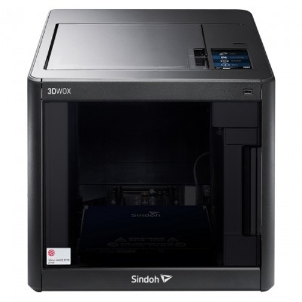

# 3D Printer
3D printing is any of various processes in which material is joined or solidified under computer control to create a three-dimensional object,[1] with material being added together (such as liquid molecules or powder grains being fused together), typically layer by layer. In the 1990s, 3D printing techniques were considered suitable only for the production of functional or aesthetical prototypes and a more appropriate term was rapid prototyping. Today, the precision, repeatability and material range have increased to the point that 3D printing is considered as an industrial production technology, with the name of additive manufacturing. 3D printed objects can have a very complex shape or geometry and are always produced starting from a digital 3D model or a CAD file. There are many different 3D printing processes, that can be grouped into seven categories:

