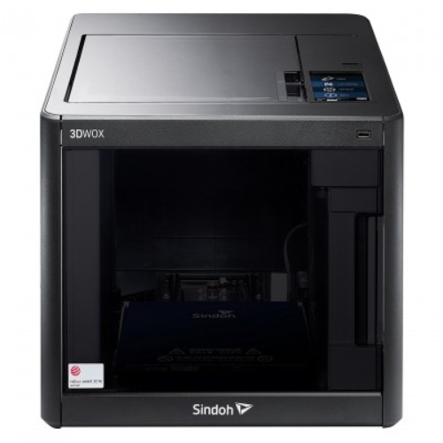

# 3D Printer
3D printing is any of various processes in which material is joined or solidified under computer control to create a three-dimensional object,[1] with material being added together (such as liquid molecules or powder grains being fused together), typically layer by layer. In the 1990s, 3D printing techniques were considered suitable only for the production of functional or aesthetical prototypes and a more appropriate term was rapid prototyping. Today, the precision, repeatability and material range have increased to the point that 3D printing is considered as an industrial production technology, with the name of additive manufacturing. 3D printed objects can have a very complex shape or geometry and are always produced starting from a digital 3D model or a CAD file. There are many different 3D printing processes, that can be grouped into seven categories:

[User Manual](../pdf/sindho.pdf)

What is 3DWOX?
3DWOX is a high quality 3D printer based on user friendly functions. Easy to use TOUCH UI, intergrated with an internal camera, automatic filament installation etc. easy to use even for first time users. Wide variety of PLA and ABS colors. Build your dreams into reality.

What files can I print with my 3D Printer?
Ply. Obj, stl format files are supported. Currently on the basis of Stl files, files under 200mb can be printed.

What is a filament?
Material for FFF system 3D printer. The main properties of filament is plastic, however there are filaments where metal and even wood is infused.

How to load/unload the filament?
Turn on the printer, press the cartridge button on the UI, pressing the Load button will initiate the loading process. In the loaded status, press the cartridge button in UI, the Unload button will initiate the unload process.

