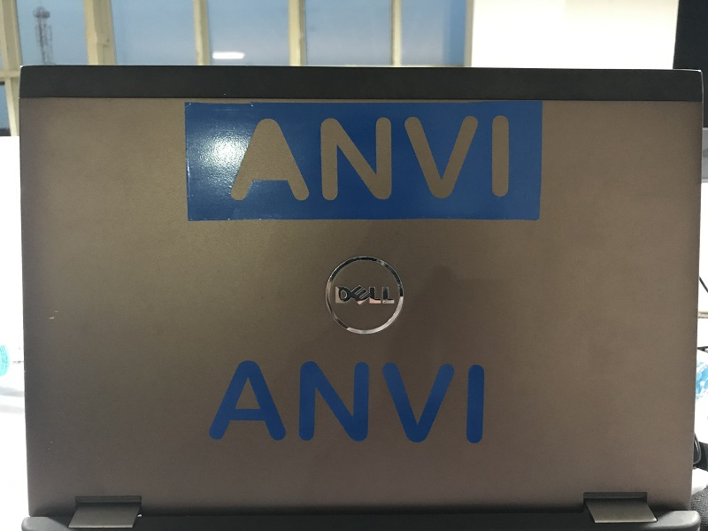
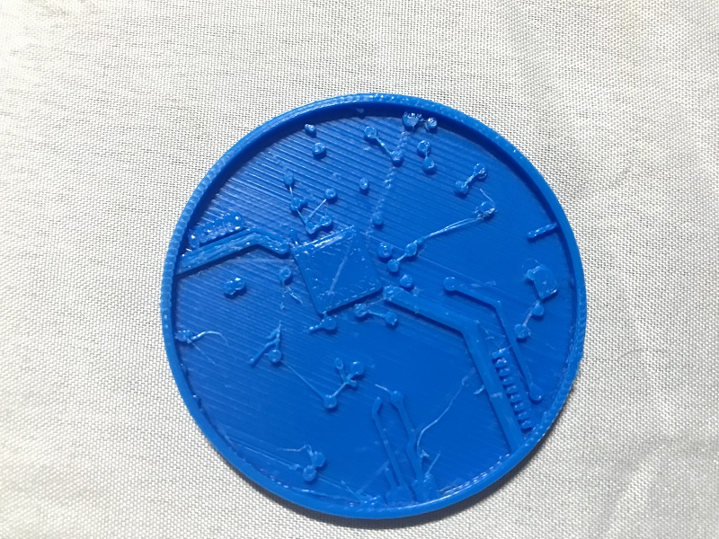

## Day 3 at FabZero Pre-Academy

learnt about creation of different .md files and linking in readme.md and adding images
Tea Break :tea:.
KiKad software for designing PCB Circuit has installed and mentor has explained in details of designing PCB board in KiKad software to make it physical
lunch break :rice_ball::fork_and_knife::bento:
after lunch break mentor has started handson training on vinyl cutter
using inkscape software we made our name to print in 150x50px and saved as png image with 600dpi
http://fabmodules.org/ has used to print image in roland vinyl machine with 20 velocity and printed. vinyl sticker has cutted and  pasted using transfer tape and pasted on my laptop.

3D image has downloaded from thinkiverse.com and same has printed using 3D Wox desktop sindoh

