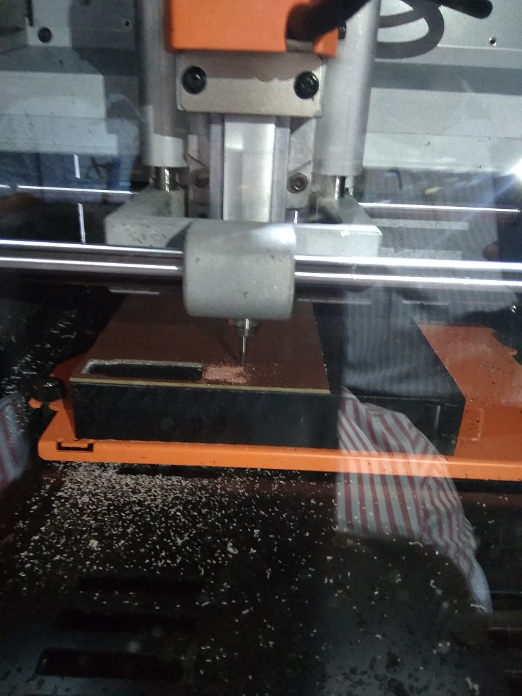
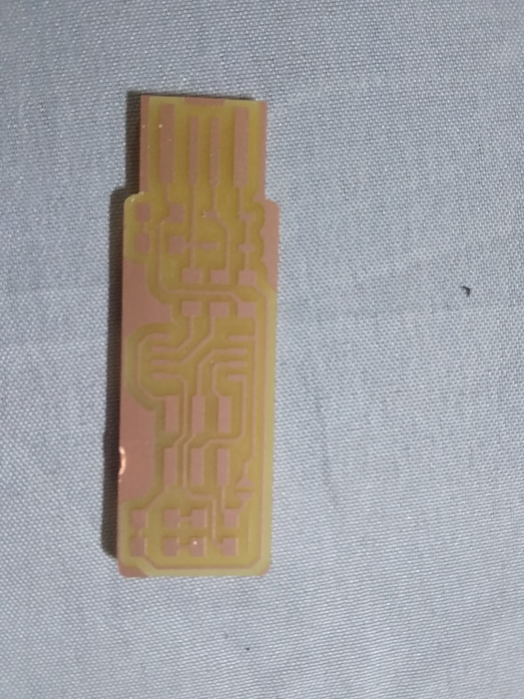
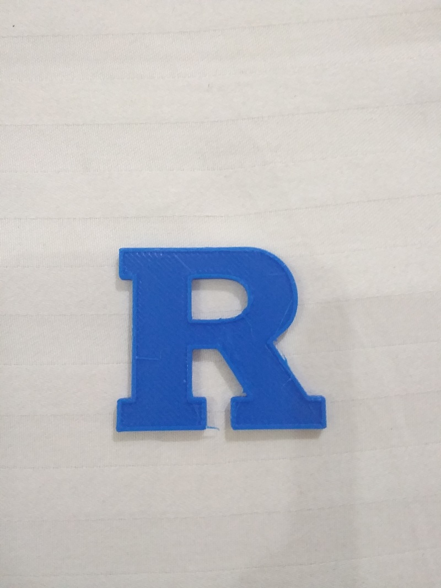

## Day 4 at FabZero Pre-Academy

Design and Fabrication of a programable electronic circuit The process will start with designing the electronic circuit and developing its PCB diagram by using Kicad software and then send it for milling.
using milling machine i have done pcb design
two different drilling machine blade with different size is used for milling and cutting of PCB as we required

3D image has downloaded from thinkiverse.com and same has printed using 3D Wox desktop sindoh

