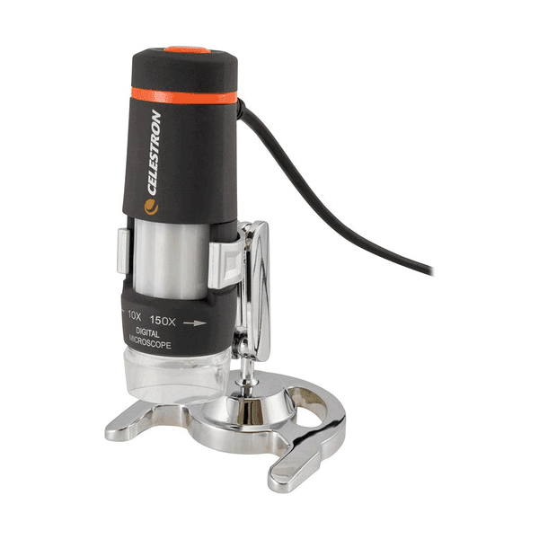

## Celestron Handheld Digital Microscope

The intermediate-level Celestron Deluxe Handheld Digital Microscope is an easy to use, low power microscope. With powers of 10x to 150x, it’s ideal for viewing stamps, coins, bugs, plants, rocks, skin, gems, circuit boards, and more. With the higher power magnifications, you can even view traditional microscope slides.

Best of all, you can capture your discoveries using the built-in 2.0 MP camera. Press the camera button to save images and VGA-quality video directly to your PC. Image captures up to 1920 X 1080 pixels to view your subject with clarity even on large monitors.

The LED illuminator ensures your specimens are clear and bright. An included metal stand allows for steady shots and comes in handy when viewing at higher powers, minimizing shaking and keeping your specimen in sharp focus.

For teens and adults alike, the Deluxe Handheld Digital Microscope is a fun, educational tool. It’s well suited for hobbyists, quality control inspectors, medical professionals, and scientific researchers.

