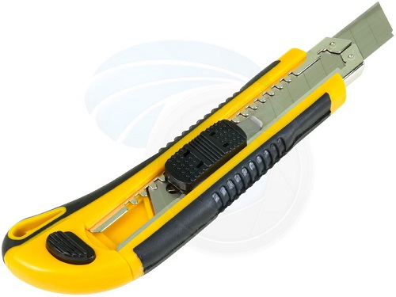

## Tweezers
Tweezers are small tools used for picking up objects too small to be easily handled with the human fingers. The word is most likely derived from tongs, pincers, or scissors-like pliers used to grab or hold hot objects since the dawn of recorded history. In a scientific or medical context they are normally referred to as forceps.

Tweezers make use of two third-class levers connected at one fixed end (the fulcrum point of each lever), with the pincers at the others.

People commonly use tweezers mainly for tasks such as plucking hair from the face or eyebrows, often using the term eyebrow tweezers. Other common uses for tweezers are as a tool to manipulate small objects, including for example small, particularly surface-mount, electronic parts, and small mechanical parts for models and precision mechanisms. Stamp collectors use tweezers (stamp tongs) to handle postage stamps which, while large enough to pick up by hand, could be damaged by handling; the jaws of stamp tongs are smooth. One example of a specialized use is picking out flakes of gold in gold panning. Tweezers are also used in kitchens for food presentation[1] to remove bones from fillets of fish in a process known as pin boning.

## Retractable blade knife

The largest construction or workplace utility knives typically feature retractable and replaceable blades, made of either die-cast metal or molded plastic. Some use standard razor blades, others specialized double-ended utility blades. The user can adjust how far the blade extends from the handle, so that, for example, the knife can be used to cut the tape sealing a package without damaging the contents of the package. When the blade becomes dull, it can be quickly reversed or switched for a new one. Spare or used blades are stored in the hollow handle of some models, and can be accessed by removing a screw and opening the handle. Other models feature a quick-change mechanism that allows replacing the blade without tools, as well as a flip-out blade storage tray. The blades for this type of utility knife come in both double- and single-ended versions, and are interchangeable with many, but not all, of the later copies. Specialized blades also exist for cutting string, linoleum, and other materials.

##  Shear Cutter

