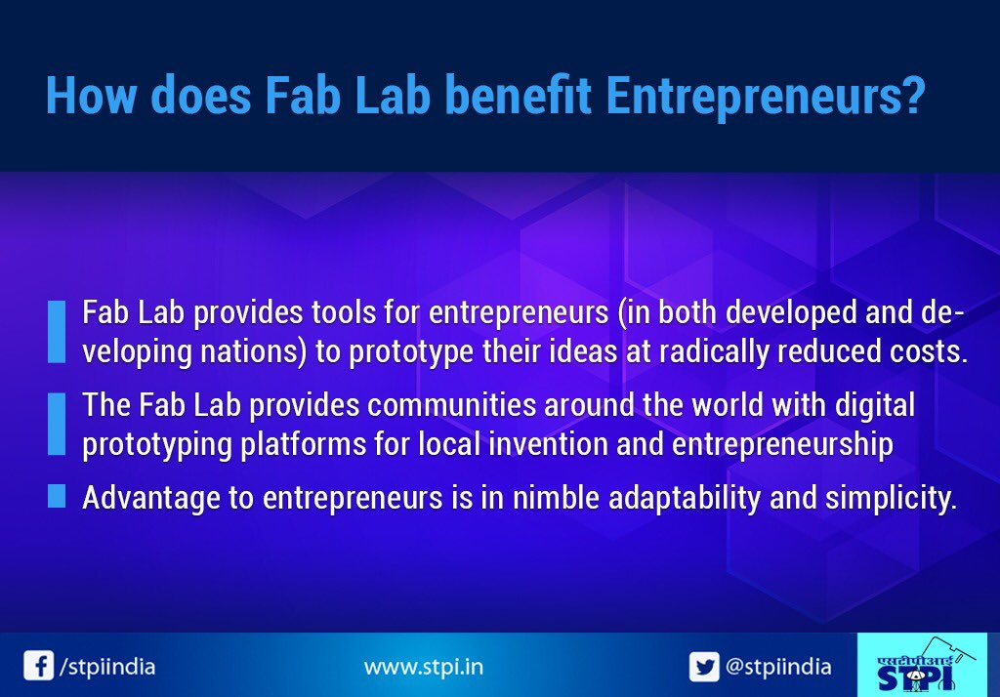
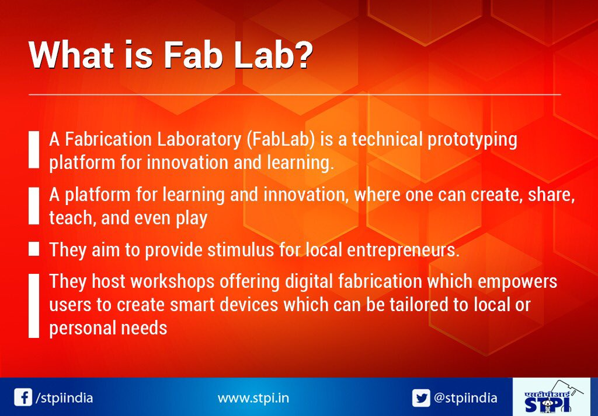

# Fab Lab
A fab lab (fabrication laboratory) is a small-scale workshop offering (personal) digital fabrication.[1][2]

A fab lab is typically equipped with an array of flexible computer-controlled tools that cover several different length scales and various materials, with the aim to make "almost anything".[3] This includes technology-enabled products generally perceived as limited to mass production.

While fab labs have yet to compete with mass production and its associated economies of scale in fabricating widely distributed products, they have already shown the potential to empower individuals to create smart devices for themselves. These devices can be tailored to local or personal needs in ways that are not practical or economical using mass production.

The fab lab movement is closely aligned with the DIY movement, open-source hardware, maker culture, and the free and open-source movement, and shares philosophy as well as technology with them.

## History

The fab lab program was initiated to broadly explore how the content of information relates to its physical representation and how an under-served community can be powered by technology at the grassroots level.[4] The program began as a collaboration between the Grassroots Invention Group and the Center for Bits and Atoms at the Media Lab in the Massachusetts Institute of Technology with a grant from the National Science Foundation (Washington, D.C.) in 2001.[5]

Vigyan Ashram in India was the first fab lab to be set up outside MIT. It is established in 2002 and received capital equipment by NSF-USA and IITK

While the Grassroots Invention Group is no longer in the Media Lab, The Center for Bits and Atoms consortium is still actively involved in continuing research in areas related to description and fabrication but does not operate or maintain any of the labs worldwide (with the excmobile fab lab). The fab lab concept also grew out of a popular class at MIT (MAS.863) named "How To Make (Almost) Anything". The class is still offered in the fall semesters.

## Fab Academy
Fab Academy leverages the Fab Lab network to teach hands-on, digital fabrication skills.[7] Students convene at Fab Lab "Supernodes" for the 19 week course to earn a diploma and build a portfolio. In some cases, the diploma is accredited or offers academic credit.[8] The curriculum is based on MIT's rapid prototyping course MAS 836: How to Make (Almost) Anything.[9] The course is estimated to cost 5000 USD, but varies with location and available scholarship opportunities.

## List of labs
MIT maintained a listing of all official Fab Labs, worldwide, until 2014. Nowadays listing of all official Fab Labs is maintained by the community through website fablabs.io. As of December 2017, there existed 1205 Fab Labs in the world in total.[12] Currently there are Fab Labs on every continent except Antarctica.

## Benefits of Fab Lab

## What is Fab Lab..?
