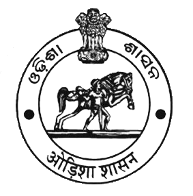

## STPI inks MoU with Fab Foundation to set up fabrication lab in Bhubaneswar

The Software Technology Parks of India (STPI), an autonomous body under the Ministry of Electronics and Information Technology (Meity), has entered into a memorandum of understanding (MoU) with US-based Fab Foundation for setting up a Fab (fabrication) Lab in Bhubaneswar.

A Fab lab is a technical prototyping platform for innovation and learning aimed at providing stimulus for promoting local entrepreneurship. The lab provides tools for entrepreneurs, in both developed and developing nations, to prototype their ideas at reduced cost.

“Entrepreneurs and researchers are aspiring to innovate and Fab Lab provides excellent platform for creativity and prototyping. India needs democratized and economically affordable technologies to push forward it as a product nation”, said STPI’s Director General Omkar Rai.

Sherry Lassiter, President and CEO of The Fab Foundation was in India recently and discussed for setting up fab labs in different parts of the country. She also visited Odisha and met the secretary of the state Electronics and IT department.

With the support of the Kerala government, the Kerala Startup Mission (KSUM) has already started two MIT USA Electronics Fabrication labs each at Technopark, Trivandrum and Kerala Technology Innovation Zone (KTIZ), Kochi.

The Fab Lab in Bhubaneswar will be hosted at STPI’s newly inaugurated facility ‘STPI Elite’. The innovative lab will see an investment of Rs 60-70 million to be shared by the Odisha government and STPI equally. The funds have been already for sanctioned for the projects.

Sprawling across three acres of land, the state-of-the-art building of STPI will house next generation incubation facility, fabrication lab in ESDM Incubation & data centre to cater the need of the IT (information technology) ITes (enabled services) and ESDM (electronics system design & manufacturing) industries.

STPI has a significant presence in Odisha. It has eight centres in the state, the highest among all states. While four centres are already operational, the balance is yet to come up. STPI has four operational centres in Bhubaneswar, Rourkela, Berhampur and Balasore. The balance four new STPI centres will come up at Angul, Jajpur, Koraput (Jeypore) and Sambalpur.

