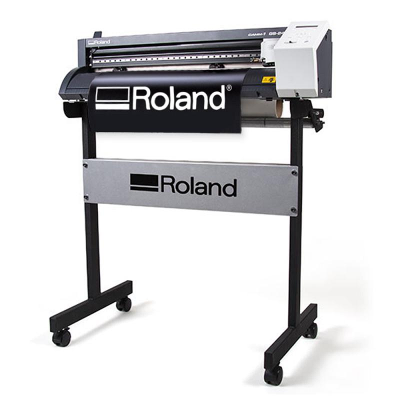

# Vinyl Cutter
A vinyl cutter is a type of computer-controlled machine. Small vinyl cutters look like a desktop printer. Like a printer controls a nozzle, the computer controls the movement of a sharp blade over the surface of the material. This blade is used to cut out shapes and letters from sheets of thin self-adhesive plastic (vinyl). The vinyl can then be stuck to a variety of surfaces depending on the adhesive and type of material.

To cut out a design a vector-based image must be created in a software program (usually Adobe Illustrator or Corel Draw). It is then sent to the cutter where it cuts along the vector paths laid out in the design. The cutter is capable of moving the blade on an X and Y axis over the material, cutting it into any shape imaginable. Since the vinyl material comes in long rolls, projects with significant length like banners or billboards can be easily cut as well.

The one major limitation with vinyl cutters is that they can only cut shapes from solid colours of vinyl. A design with multiple colours must have each colour cut separately and then layered on top of each other as it is applied to the substrate. Also, since the shapes are cut out of solid colours, photographs and gradients cannot be reproduced with a stand alone cutter.

In addition to the capabilities of the cutter itself, the adhesive vinyl comes in a wide variety of colours and materials including gold and silver foil, vinyl that simulates frosted glass, holographic vinyl, reflective vinyl, thermal transfer material, and even clear vinyl imbedded with gold leaf. (Often used in the lettering on fire trucks and rescue vehicles.

### Installing a Blade
